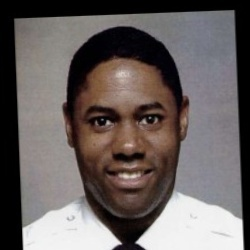
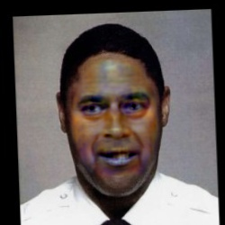

# FaceSwapping: A Demo Face Swapping Project 

| Source | Target | Final Composite |
| :---: | :---: | :---: |
|  |  |  |

|Source| Target and FaceSwap|
|:---:|:---:|
|||

This repository is small project where we train a face swapping model from an existing dataset, entirely from scratch. We **strongly recommend** the user to read through the [Design Choices](docs/DesignChoices.md) document, as it covers the training pipeline all available features.

TLDR:
- You can use this repo for face swapping images and videos
- The face swapping model is an adversarial GAN framework [SimSwap](https://github.com/neuralchen/SimSwap/tree/main), and only the generator is needed for face swapping inference.
- You can train the model.
- You can run inference on the model, by [downloading](https://drive.google.com/file/d/1oKUM5PYwWc1DvVxP69BTTkwJPPOpzkP-/view?usp=sharing) the checkpoints code version.


## Code Setup

Clone Repo
```
git clone https://github.com/sagoyal2/FaceSwapping.git DemoFaceSwapping
```

Create and enable environment (with uv)
```
curl -LsSf https://astral.sh/uv/install.sh | sh
cd DemoFaceSwapping
uv venv
source .venv/bin/activate
uv pip install -r requirements.txt
uv pip install -e . # This allows you run scripts inside this repo

# To install more packages:
# uv pip install

# To save later packages in requirements.txt
# uv pip freeze > requirements.txt
```

## Copy Data and Models
This repo assumes you have a Data folder like `DemoFaceSwappingData` where you will store temporary data and models. First download and unpack the kaggle dataset.

```
# Right beside you DemoFaceSwapping repo
mkdir DemoFaceSwappingData

DemoFaceSwappingData/
└── lfw-funneled/
    ├── Aaron_Eckhart
    ├── Aaron_Guiel
    └── ...

```

Download and Unpack the Face Swapping Model
NOTE: this folder contains multiple checkpoints for different iterations. We recommend using the last one `generator_iter_1649.pt` for best results
```
gdown https://drive.google.com/uc?id=1oKUM5PYwWc1DvVxP69BTTkwJPPOpzkP-
mv model_checkpoints.zip ~/DemoFaceSwappingData/model_checkpoints.zip
unzip model_checkpoints.zip
```

Download Arc Face Model given by SimSwap
```
gdown https://drive.google.com/uc?id=1TLNdIufzwesDbyr_nVTR7Zrx9oRHLM_N
mkdir ~/DemoFaceSwappingData/arcface_checkpoint
mv arcface_checkpoint.tar ~/DemoFaceSwappingData/arcface_checkpoint/arcface_checkpoint.tar 
```

Download Segmentation Model given by [BiSeNet](https://github.com/yakhyo/face-parsing)
```
curl -L -o resnet18.onnx https://github.com/yakhyo/face-parsing/releases/download/weights/resnet18.onnx
mkdir ~/DemoFaceSwappingData/segmentation_model
mv resnet18.onnx ~/DemoFaceSwappingData/segmentation_model/resnet18.onnx
```


## Training from Scratch

### Data Curation
If you have just downloaded the kaggle dataset you will need to preprocess it. This takes about 1.5-2 hours to complete.
```
# this script assume you have your data stored here:
# "/home/ubuntu/DemoFaceSwappingData/lfw_funneled" 
# and will place your filtered data here:
# "/home/ubuntu/DemoFaceSwappingData/lfw_funneled_cropped_aligned_224"

python preprocess/filter_crop_align.py
```

If you want to train on your own dataset, then make sure it is formatted such that each identity has it's own folder with images.
```
DemoFaceSwappingData/
└── custom_data_set/
    ├── person_1/
    │   └── person_1_img1
    └── person_2/
        ├── person_2_img1
        ├── person_2_img2
        └── ...

# you can still run this but you will need to change the paths within the file.
python preprocess/filter_crop_align.py
```

### Training
Once your data is curated you can run training on A100 with the command. If you don't have an A100 then you can use an A10 but you will need to decrease the to `BATCH_SIZE=44` inside the `trainer.py` file. Then run
```
python train/trainer.py
```

This will also give you nice TensorBoard logs, so you can visualize the training as it progresses. Feel free to change the hyper-parameters or logging iteration as desired.

## Inference
If you trained the model from scratch the model checkpoints are saved under `/home/ubuntu/DemoFaceSwapping/runs/simswap/checkpoints\run_{name}\*.pt` path

If you downloaded them then they are saved in `~/DemoFaceSwappingData/model_checkpoints`. It is recommended to use the latest checkpoint so `~/DemoFaceSwappingData/model_checkpoints/generator_iter_1649.pt`.

It is recommended that your images and videos are clean (no blur, makeup, extreme expression, motion blur, or harsh lighting) and are already cropped/isolated around a single subject. If multiple faces are present, the first one detected is used. We provide some example images and videos in the `/evaluation` folder.

### Image to Image (I2I)
If you would like to run inference to do face swapping from an image to another image you need to run the `inference/inference_I2I.py` script.
```
# If you have exact checkpoint, source and target paths available (example from kaggle dataset)
python inference/inference_I2I.py \
--checkpoint /home/ubuntu/DemoFaceSwapping/runs/simswap/checkpoints/run_20260504-030233/generator_iter_1649.pt \
--source_image_path /home/ubuntu/DemoFaceSwappingData/lfw_funneled/Prince_Charles/Prince_Charles_0002.jpg \
--target_image_path /home/ubuntu/DemoFaceSwappingData/lfw_funneled/Hermando_Harton/Hermando_Harton_0001.jpg \
--result_folder_path /home/ubuntu/DemoFaceSwapping/scratch/test_Prince_Charles_0002_to_Hermando_Harton_0001

# If you have exact checkpoint, source and target paths available (example from current repo)
python inference/inference_I2I.py \
--checkpoint /home/ubuntu/DemoFaceSwappingData/model_checkpoints/generator_iter_1649.pt \
--source_image_path /home/ubuntu/DemoFaceSwapping/evaluation/lfw_images/Angelina_Jolie_0009.jpg \
--target_image_path /home/ubuntu/DemoFaceSwapping/evaluation/lfw_images/Pierce_Brosnan_0001.jpg \
--result_folder_path /home/ubuntu/DemoFaceSwapping/scratch/test_Angelina_Jolie_0009_to_Pierce_Brosnan_0001


# If you are just curious to try any random images in the dataset you only need to provide the checkpoint path
python inference/inference_I2I.py \
--checkpoint /home/ubuntu/DemoFaceSwapping/runs/simswap/checkpoints/run_20260504-030233/generator_iter_1649.pt
```

### Image to Video (I2V)
If you would like to run inference to do face swapping on an image to a video you need to run the `inference/inference_I2V.py` script.
```
# If you have an exact checkpoint, source and target available (example from kaggle dataset)
python inference/inference_I2V.py \
--checkpoint /home/ubuntu/DemoFaceSwapping/runs/simswap/checkpoints/run_20260504-030233/generator_iter_1649.pt \
--target_video_path /home/ubuntu/DemoFaceSwapping/evaluation/vhfq_videos/vfhq_1_448_448.mov \
--source_image_path /home/ubuntu/DemoFaceSwappingData/lfw_funneled/Prince_Charles/Prince_Charles_0002.jpg \
--result_folder_path /home/ubuntu/DemoFaceSwapping/scratch/test_Prince_Charles_0002_to_vfhq_1_448_448

# If you have exact checkpoint, source and target paths available (example from current repo)
python inference/inference_I2V.py \
--checkpoint /home/ubuntu/DemoFaceSwappingData/model_checkpoints/generator_iter_1649.pt \
--target_video_path /home/ubuntu/DemoFaceSwapping/evaluation/celebvhq_videos/celebvhq_3_448_448.mov \
--source_image_path /home/ubuntu/DemoFaceSwapping/evaluation/lfw_images/Pierce_Brosnan_0001.jpg \
--result_folder_path /home/ubuntu/DemoFaceSwapping/scratch/test_Pierce_Brosnan_0001_to_celebvhq_3_448_448


# If you are just curious to try any random images in the dataset you only need to provide the checkpoint path and video path
python inference/inference_I2V.py \
--checkpoint /home/ubuntu/DemoFaceSwapping/runs/simswap/checkpoints/run_20260504-030233/generator_iter_1649.pt \
--target_video_path /home/ubuntu/DemoFaceSwapping/evaluation/celebvhq_videos/celebvhq_3_448_448.mov
```

## Ethics Statement
Face synthesis and manipulation technologies can be misused to spread misinformation, enable fraud, and harm individuals’ privacy and reputation. This work is intended solely for research and educational purposes, with the goal of better understanding model behavior, limitations, and potential risks. We do not support or condone malicious use, and encourage responsible development, evaluation, and deployment of such systems.