# Overview
We will create an AI-powered face swap model that can replace a face in an input image with another face while maintaining natural expressions, skin tone, and blending quality. The system works on both images and (extension) videos.

This markdown file contains all the system design decisions for each part of the training pipeline, and the repository is a practical reference to reproduce all of the components.

Table of contents:

 - [Data Curation](#data-curation)
 - [Architecture Decisions](#architecture-decisions)
 - [Model Training](#model-training)
 - [Evaluation](#evaluation)
 - [Results](#results)
 - [Limitations and Future Works](#limitations-and-future-works)


## Data Curation
We will be using an open source dataset: https://www.kaggle.com/datasets/atulanandjha/lfwpeople?resource=download which contains 13233 images of shape 250 by 250 px with 5749 identities. The core limitation of our model stems from this data scarcity, ~10k image is minuscule compared to the existing face datasets like [Celeba-HQ](https://celebv-hq.github.io/), [FFHQ](https://github.com/nvlabs/ffhq-dataset) and [VGGFace2-HQ](https://github.com/neuralchen/SimSwap/tree/main#). 

To make matters worse, the majority of these identities (4069) only contain a single image. Having multiple images of a single identity, is important so that the model learns that identity is something that is **invariant** to expression, pose, and lighting. With just a single image the model will learn that the identity is synonymous with appearance. But a small dataset is computationally easier to work with and serves as a good baseline on what to expect with improved resources.

After browsing some of the faces we noticed several artifacts that would degrade model performance, so we designed the following filters.

#### Filters
**Blur**: We wanted our images to be sharp, as blurry images would provide a weak signal for the identity extraction. We use the [Variance of Laplacian](https://opencv.org/blog/autofocus-using-opencv-a-comparative-study-of-focus-measures-for-sharpness-assessment/) as our metric to score image blurriness. The second order derivative measures the change in image edges, and a higher variance indicates shaper images. We set an empirical threshold of 13.4 and only select images that are above that. Here are some examples of images and corresponding thresholds that were discarded:

| Laura_Bush_0009.jpg (3.79) | Martin_Boryczewski_0001.jpg (9.12) | Bela_Karolyi_0001.jpg (10.87)|
| :---: | :---: | :--:|
| 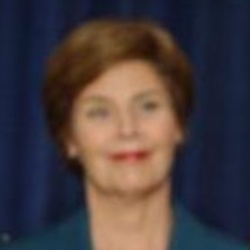 | 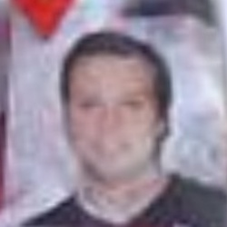 | 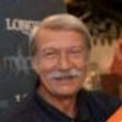 |


**Cropping And Alignment**: FaceSwapping models perform best when provided with as much standardized geometric structure as possible, thus we crop and align all images to a canonical space. We follow standard practice and detect key-points on the face and then warp the bounding box to fixed resolution. We use [InsightFace detection model](https://github.com/deepinsight/insightface/tree/master/python-package) to select the highest confidence face. We use [InsightFace face_align method](https://github.com/deepinsight/insightface/blob/master/python-package/insightface/utils/face_align.py) to transform the bounding box to an upright frame with a fixed resolution of 224 by 224. We choose this resolution as for ArcFace based identity extraction is just a multiple of two (112 by 112) and the original image size is 250 by 250 so the face resolution is only marginally increased.

**Poor Crop Selection**: Unfortunately for some images in the dataset, there is more than one face in the image. So the highest confidence face detected does not always mean the largest or most central one. We discovered this error while browsing our evaluated images during training. Instead of rerunning the data processing scripts we simply checked if the images had black pixels that covered more than 9% of region and removed them. Here are some examples of the (incorrect) highest confidence faces that were detected relative to the original image.

| Xanana_Gusmao_0002.jpg | Earl_Counter_0001.jpg | George_W_Bush_0294.jpg|
| :---: | :---: | :--:|
| 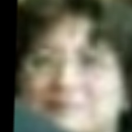 | 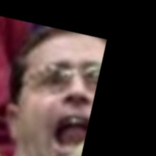 | 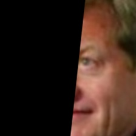 |
| 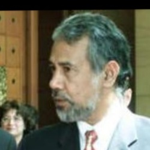 | 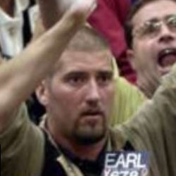 |  |

*Correction* I only later realized that InsightFace does not automatically sort faces that it returns, so a better solution would be to sort by confidence and largest face.

**Occluding Accessories**: Within the tight face crop, we wanted to ensure that only clearly visible faces were present. If an accessory occluded part of a person's face it would get mistake and entangled with that person's identity. And since we did not have multiple images of that person without those accessories, it would hurt model performance. So we used [BiSeNet](https://github.com/yakhyo/face-parsing/) an off the shelf face-parsing model to remove face crops with accessories (glasses, earrings, clothing, hair, hats) covering more than 65% of the image.

| Howard_Stern_0001.jpg | Kelly_Osbourne_0001.jpg | Cristina_Torrens_Valero_0001.jpg|
| :---: | :---: | :--:|
| 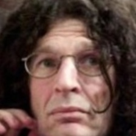 | 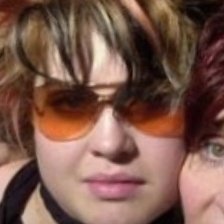 | 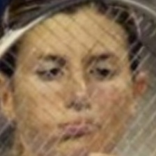 |


After these curation steps, our total dataset contains 13013 images of shape 224 by 224 px with 5673 identities. So we removed ~200 images which is about 1.5% of the data, not huge but best to avoid systematically bad face images.

If you would like to update the dataset, first make sure to do face identity clustering to sort the individual into their respective folder, then you can run `preprocess/filter_crop_align.py` after making changes to your `RAW_DATA` and `OUTPUT_DIR` paths. Then you simply store these new curated images along with the original dataset in superset folder and you can continue with model training section.

## Architecture Decisions
Nowadays face swapping / reenactment can be done with tools like [WanAnimate](https://humanaigc.github.io/wan-animate/) which uses a large diffusion based foundation model [Wan 2.2](https://github.com/Wan-Video/Wan2.2) and adapt it for faces. So an off the shelf solution for the task would have been to just wire the proper interface on such a model for I2I or I2V generation. 

**Background**: However the goal of this project was to specifically use a given dataset to train a deepfake generation model from scratch. The fundamental idea behind face swapping is to take the `identity` information from a `source image` and replace it with that of the `target image`, while maintaining the `expression, pose, and appearance` of the target image. This framing nicely aligned into the prominent UNet style architecture of the early 2020s, just as when face swapping quality was becoming increasingly proficient. For this project  our first attempts were based on these more "traditional" methods, like  [InsightFace Inswapper](https://github.com/deepinsight/insightface/tree/master/examples/in_swapper). Yet, they did not release a publicly available paper or architecture overview. 

**SimSwap Paper**: So we turned to [SimSwap](https://arxiv.org/abs/2106.06340), an accessible entry point serving as our baseline for a face swapping model.

This method has the following properties we like for the task of general purpose face swapping:
1. It uses ArcFace as the mechanism to extract the identity component from the source image.
2. It uses a UNet style encoder-decoder architecture to modify the target image. This keeps the expression, pose, lighting, makeup constrained by the target image and only injects the new identity image via the bottleneck.
3. It adds a light GAN based training objective at the end of the generator to ensure the the generated image is in distribution to real world faces. This improves visual quality

Most importantly, it is practically accessible for a demo project:
1. The model architecture is a convolutional UNet with StyleGan like bottleneck layer. Thus it is parameter efficient and small enough to train and experiment with on low/mid tier machines like A10 or A100s.  We don't/can't use heavier machinery like transformers or diffusion models to generate images, since our dataset is small and wouldn't provide enough structure.
2. It's open source implementation is fairly well documented and provides a good baseline. 

Assuming you have read the [SimSwap](https://arxiv.org/abs/2106.06340) paper, we will only provide a brief recap.

The core innovation of the method is isolating the identity injection module, so that the face swapping model is generalizable, as opposed to having only an encoder-decoder style model which needs to be retrained for each identity pair we wish to face swap. In SimSwap, the encoder portion extract a feature representation from a target image. This feature contains entangled identity and other attributes. The goal of the identity injection module is to modify the target images identity with the identity of the source image. This modification is similar in spirit to [StyleGan](https://arxiv.org/abs/1812.04948), where an intermediate latent space (source image's [ArcFace](https://arxiv.org/abs/1801.07698) embedding) acts as a control for an adaptive layer normalization for each convolutional layer. Then the decoder reconstructs the final image, only focusing on restoration. The decoder will be general since it is trained over multiple identities.

To smooth the concatenation of identity from one source and appearance and expression from another target, the paper utilizes adversarial training. The Encoder, Identity Bottleneck, Decoder become the generator and the Discriminator is based of a [PatchGan](https://arxiv.org/pdf/1611.07004) model.

The losses are as expected (Identity, Reconstruction, Hinge based GAN, and Weak Feature Matching). The Weak Feature Matching loss uses the latent representation of later layers of the discriminator to measure (hidden) structural similarity between the generated image and the target.

| SimSwap Architecture by Chen et al.|
|:---:|
|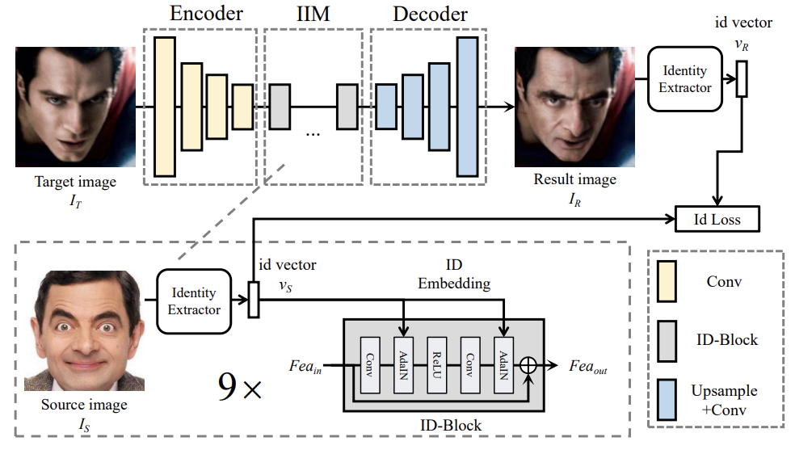|

**SimSwap Code**: In the repository, the generator consists of an encoder/decoder which has 3 down/up blocks, decreasing/increase spatial resolution by 2 and channel dimensions by a factor of 2 as well (starting from 64). The bottleneck layer follows equation 1 in the paper. The discriminator however, deviates from the paper description. Instead of using a PatchGan like setup, it uses an [EfficientNet](https://github.com/huggingface/pytorch-image-models/blob/main/timm/models/efficientnet.py) backbone from timm as the feature network and then attaches 4 small heads at the end to calculate the logit score.


## Model Training
This section talks about some engineering choices that were made to practically train the SimSwap model.

**Machine Type**: The generator is 55M parameters, the ArcFace Model is 13.6M parameters and the discriminator is 52M parameters, so these easily fit onto low/medium end machines like A10s and A100s. Each iteration we feed in 2 images (source, target) that are 224 by 224 by 3. On an A10 we can train with a batch size of 44 and A100 with batch size of 112. For efficiency we used an A100 for training which took about 1.5 hours. 

**Data Loading**: Following the strategy proposed in the SimSwap paper (section 4) we alternative source-target pairs with those of the same identity and those of different ones. This is done via our `AlternatingBatchPairSampler` which holds a list of identities which have more than image and those who do not. 

**Training Recipe**: We mostly followed the training recipe in the `train.py` file in the SimSwap repository, except for the following changes.

1. We noticed the discriminator loss for `Dreal` and `Dgen` were close to 0 within 300 iterations. This meant the discriminator was winning too easily, since the outputs were already beyond margin ie. D(real) >=1 and D(fake) <= -1. This was likely due to our projection heads training too quickly, since the rest of our discriminator is frozen pretrained `tf_efficientnet_lite0` model. To address this imbalance we made the following changes: We decreased the learning rate of discriminator to `0.002` (while the generator remained at `0.004`). We changed the ratio of Generator to Discriminator updates, from `1:1` to `4:1`. This helped make sure that discriminator loss was above 0.

2. Another issue we faced was that the identity matching loss while decreasing, was never sufficiently small enough to produce a visually compelling face swap. Besides increasing the weighting factor from `50` to `100` for this term, we also changed the dataloader to be more biased towards cross identity samples. Instead of alternating between positive (same identity) and negative (different identity) batches, we had a positive pair come every 4'th iteration. This was to "fix" our data distribution setting where the majority of images came from a single identity. With this change we saw there was less of a tendency to just wholly copy the target identity in the generated image.

3. Lastly, perhaps this was error that was overlooked from the original authors or it becomes less relevant as the data scales (more identities and with multiple images), but there was an incorrect scaling normalization operation applied to the source image. As written in the [original code base](https://github.com/neuralchen/SimSwap/blob/bd7b7686a17f41dd11cfcd5d82f7e4c5eb94b780/data/data_loader_Swapping.py#L30) both the target image and source image get normalized with ImageNet mean `[0.485, 0.456, 0.406]` and standard deviation `[0.229, 0.224, 0.225]`. This is fine for the target image since it gets processed by our own encoder network, however the source image gets sent to the ArcFace model which expects inputs in the range of [-1,1]. In fact, InsightFace [arcface inference script](https://github.com/deepinsight/insightface/blob/f8613d444c6c266e8ff2fb29676a0a1cba6ee7a1/python-package/insightface/model_zoo/arcface_onnx.py#L40) exactly does this by simply setting mean `0.5` and std `0.5`. This small normalization plays a critical role in our data constrained setting.

**AMP**: To speed up training we added `autocast` and `GradScaler` wrappers to enable automatic mixed precision training following the official [guidelines](https://docs.pytorch.org/tutorials/recipes/recipes/amp_recipe.html). These minimal changes gave as 2x speedup and was an easy choice since the entirety of our model is composed of convolutional and linear layers.

**GPU Utilization**: To ensure that we efficiently use compute, we used `nvitop` library to monitor gpu memory and utilization. (The gap is when we are logging)


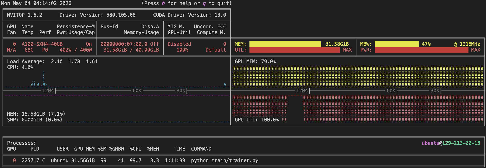

## Evaluation
The below figure shows the loss curves in TensorBoard. Recall that we have adversarial GAN framework with hinge loss. 

**Discriminator Loss** 
```
D ​ = D_real + D_gen
D_real = max(0,1−D(real​))
D_gen = max(0,1+D(gen))
```
The Discriminator outputs raw score (-inf to +inf), and should predict >= 1 for D(real) and should predict <= -1 for D(gen). The `D_gen` and `D_real` loss curves below behave as expected having higher values at the start of training, and the gradually oscillating above 0 as training continues. If the discriminator continuously outputs 0 too early that means it is too strong, and little signal will get passed back to the generator. This was what occurred in previous training runs, so we decided to update the discriminator ever 4 iterations relative to the generator, and give it a smaller learning rate.

**Generator Loss** 
```
G = G_main + G_id + G_feat + G_recon
G_main = -D(gen)
```
In order for a true face swap to occur the identity from the source must be transferred to the target, this is exactly what the identity loss  `G_id` measuring via cosine similarity between the ArcFace embedding of the source and generated image. This loss gradually decays as the number of iterations increase. On the other hand `G_feat` ensures that the generated image still matches appearance characteristics (expression, pose, lighting) of the target image. 

The reconstruction loss `G_recon` is highly variable, and as we will see below the reconstruction on identities with more than one image produce unappealing results. We believe the reason for this is the lack of samples in this single identity multi image setting, causing the model to keep seeing the same datapoints and attempting to over fit to those examples. 

Most interestingly is the `G_main` loss which is the generator GAN loss. If the generator is successful it should trick the discriminator to thinking it is a real image which will produce values >=1 results in a large negative `G_main` value. This is somewhat apparent in the figure below as the loss crosses below 0, and steadily oscillate at small negative value, indicating continued training with the discriminator.


|Generator and Discriminator Loss Curves|
|:---:|
|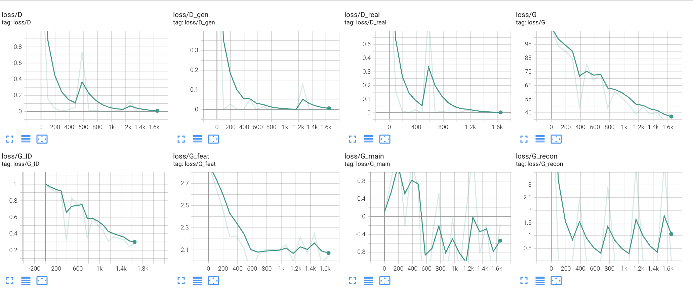|


**Qualative Results**: While quantitative results help you tune architecture and parameters, visual results are most telling for face swaps. Especially since metrics aren't able to judge aspects like the inner mouth region, facial hair, and the in painted gap between the jaw and the background which humans critics immediately recognize.


**Vaildation on LFW Dataset**
While training we also log the generated images, and we see that at later iterations there is reasonable amount of identity transfer from the source to target. Particularly regions like nose, cheeks, eyes, lips capture the most tangible sense of this transfer. For example, the bottom row on the right panel, shows how the generated images are able to capture geometric face structure like size from the source (the first image with the female source is rounder and smaller compared to the second image with the male source that is fuller). Also notice how for the sample panel in the top row, the male source provides a more rigid jaw structure to alter the female target image. 

Interestingly, some features of an individual are so prominent that they capture the majority of the identity signal and completely alter the target expression. For example, the first source on the left panel has large eyes that get almost copied to both target identities even if the expression isn't that one.

| Iteration 1455 | Iteration 1649 |
| :---: | :---: |
|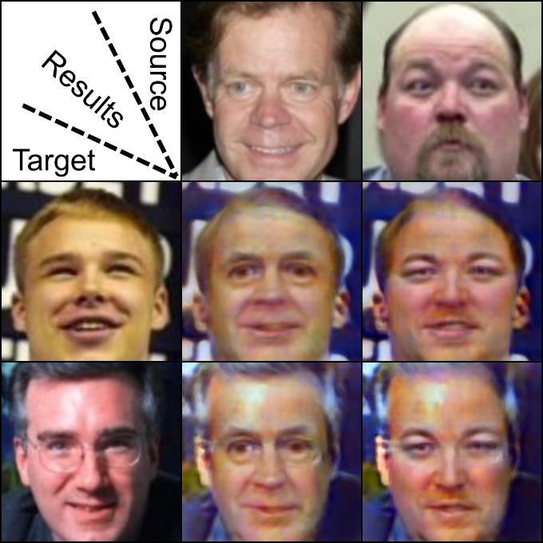|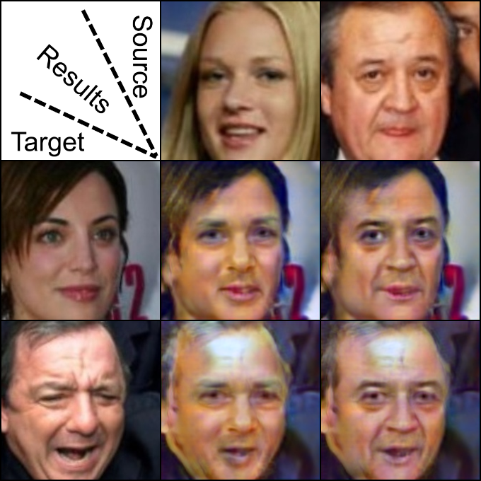|


**Reconstruction within Identity** As mentioned earlier, when the source image and target image are from the same identity the model generates unpleasant results. Having greater data richness would ease this as well as having images in different environments and expressions.


| Aaron Peirsol Iteration 1649 |
| :---: |
| 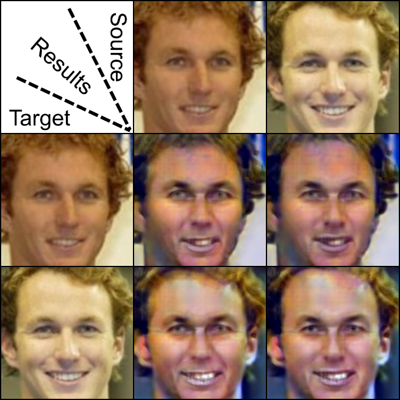 |

**Time Evolution of Model Performance** We show the evolution of the generated images while training to better elucidate which facial features of identity get transferred when. We see that lips and nose are early features that get transferred over, followed by more global structural attributes such as facial shape and cheek contours.

|Sources (Juergen Chrobog and Satnarine Sharma) to Target (Donald_Fehr and Jorge_Batlle)|
| :---: |
| 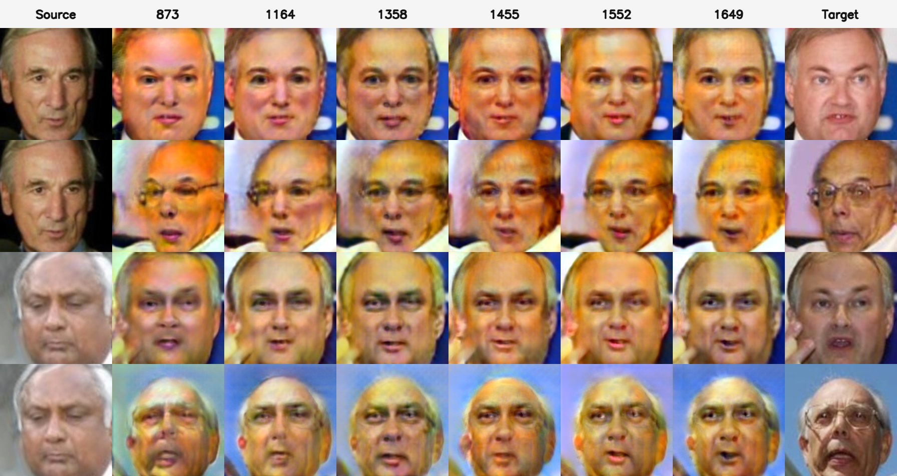 |

After examining the dataset, we observed a bias toward male and white individuals. Such imbalance can lead to degraded performance on underrepresented groups. To evaluate this effect, we conducted experiments on images of women and individuals from more diverse racial backgrounds. We also included subjects wearing glasses, an occlusion we had previously identified as a potential challenge during data curation. We notice marginal degradation of visual quality in these settings, most notable on individuals with accessories.


|Sources (Mary McCarty and Rohinton_Mistry)  to Target (Nicholas Tse and Nicolas Cage)|
| :---: |
| 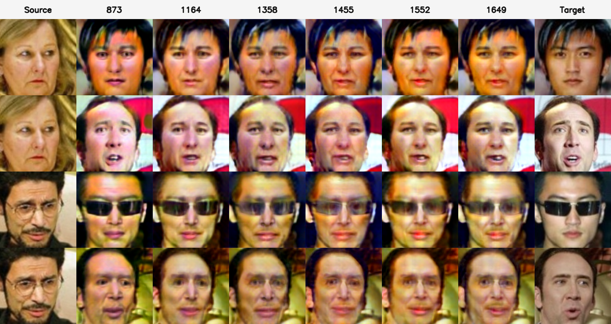 |


**Out of Distribution Evaluation (Source LFW to Target CelebVHQ)** To truly evaluate if our model is successful, we needed to test on images not in the dataset. So we collected some examples from CelebVHQ and use these as targets and pick some LFW images as sources. From the below plots we observe that the results are highly varied depending on target image quality. For example the first target image seems to be reasonably capable of picking up identity signal from the three sources. However other appearance characters are not so favorable. Facial hair (row 2), Makeup (row 3) and Hair Occlusions (row 4) are out of distribution for the training dataset so these are not suitable as face swap candidates. Furthermore extreme lighting situation like a flashlight lit face on row 5 are also out of distribution. Lastly, as seen in earlier plots since the training dataset has few high sharp quality images of people of color, face swapping in these settings is also challenging (row 6). 

|Iteration 1358 | Iteration 1649|
| :---: | :---:|
|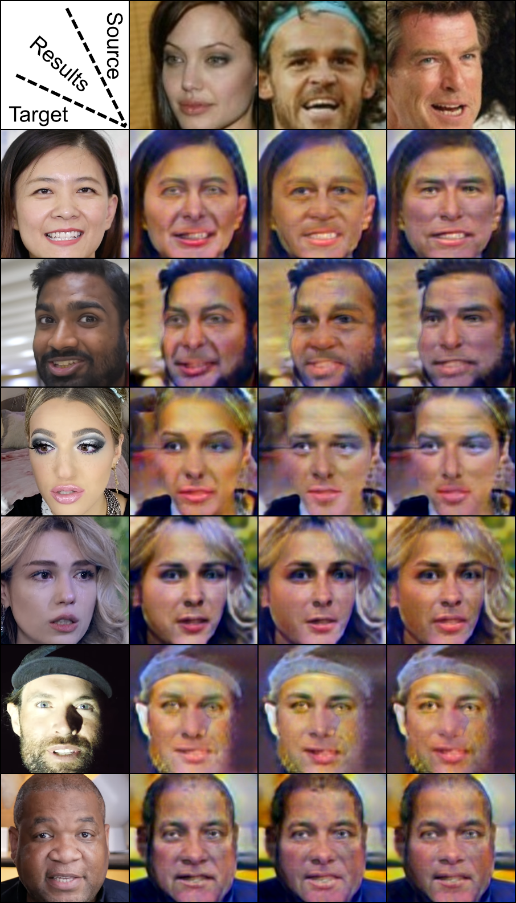|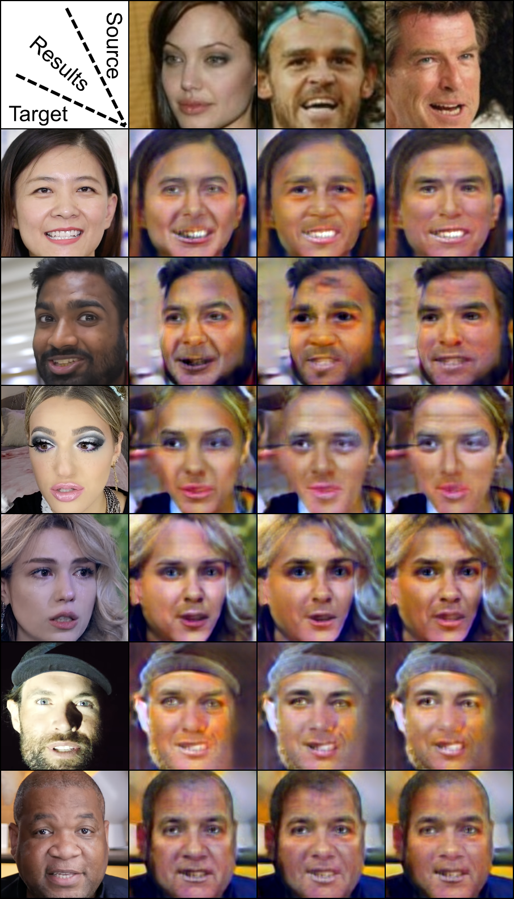|


**In the Wild on SNL** We also include an extreme in the wild testing scenario, where we took difficult sample images from the cast of SNL and evaluated our face swap model on them. Under these conditions, performance degrades due to factors not well represented in the training data, including strong stage lighting, facial hair, eye wear (e.g., tinted or shaded glasses), and greater diversity in skin tone and appearance.

|Iteration 1649|
|:---:|
|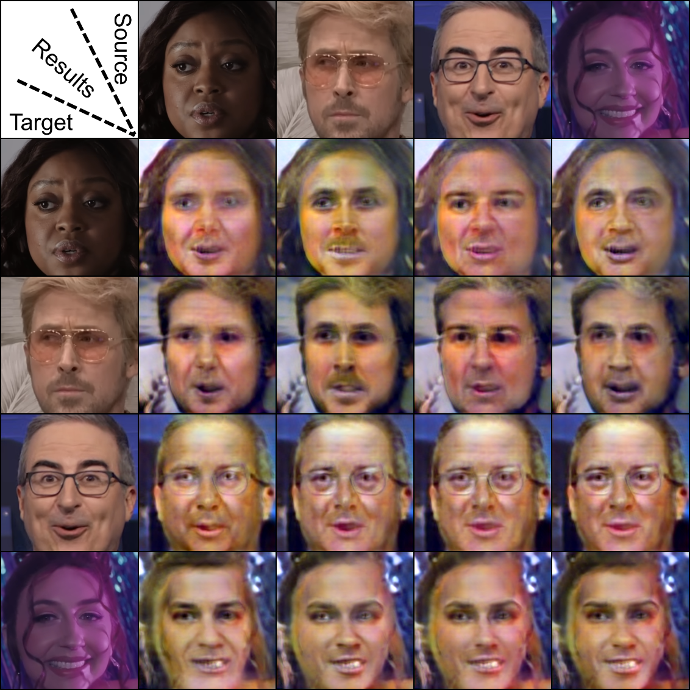|

## Results
We show the full inference results on both images and videos. Full images and videos are available inside the `docs/results_images/` folder and here we provide gifs for convenience. Our inference pipeline takes everything described above, ie. the generated model output and adds an compositing step to place the generated image back into the original frame.

**Image to Image (I2I)** 
| Source Prince_Charles_0002.jpg | Target Hermando_Harton_0001.jpg | Final Composite |
| :---: | :---: | :---: | 
||||

Starting from the raw source and target images we first crop and align the images, like in the data curation phase. Then we pass these to the model to get the generated image, and then we use the cached transform matrix from the target image to paste the render back into the proper location. This is visually represented in the figure below with original images on the top and the cropped and aligned images on the bottom. Recall that the model only operates, and is only aware of, the cropped aligned space.

| Source Prince_Charles_0002.jpg | Target Hermando_Harton_0001.jpg | Unwarped Model Output |
| :---: | :---: | :---: | 
|||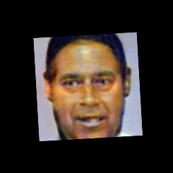|
|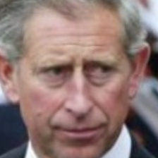|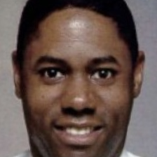|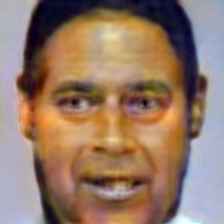|

However naively compositing the full generated image is not visually pleasing. It leaves a distinct bounding box border around the paste. To fix this, we create our own alpha mask based on the inner face segmentation (same BiSeNet model from the data curation step) of the target image. This area represents the region we wish to truly face swap. Then to smooth out the edges we erode and add gaussian blur to the edges. This is derived from the [paste back](https://github.com/deepinsight/insightface/blob/f8613d444c6c266e8ff2fb29676a0a1cba6ee7a1/python-package/insightface/model_zoo/inswapper.py#L46) function in InsightFace Inswapper.

| Mask Description | Alpha Mask | Composite |
| :---: | :---: | :---: | 
| Original Cropped Region| 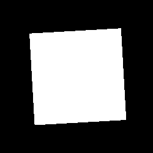|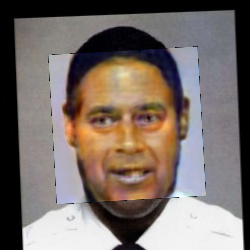|
| Face Segmentation + Erosion + Blur| |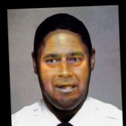|

While this produces visually pleasing blends with the original frame, we still have a noticeable color difference. To fix this we use a simple classical trick to match the mean statistics of the segmented region. We simple compute the mean color between the target image and the generated image, within the segmented region, and add the difference back to the generated image. This small fix address the issue that the generator was unable to truly maintain the color consistency from the target image.

| Bounding Box| Segmentation + Blur | Color Correction|
| :---: | :---: | :---: | 
||||

Below are more representative examples of the full image to image pipeline. We see varying degrees of success based on image quality, as already described above, and blurriness and expression.

Row order (source -> target):

- Carlos_Barra -> Dorothy_Wilson
- Frank_Schmoekel -> Jewel_Howard-Taylor
- Gerard_Butler -> Frank_Griswold
- Jason_Sorens -> Mike_Bair
- Juergen_Braehmer -> Shimon_Peres
- Mark_Wahlberg -> Chen_Tsai-chin
- Paul_Murphy -> Nancy_Reagan
- Steve_Spurrier -> Brian_Campbell
- Laura_Marlow -> Alejandro_Gonzalez_Inarritu

| Source | Target |  Crop Box | Segmentation + Blur | Color Correction |
| :---: | :---: | :---: | :---: | :---: |
|  | 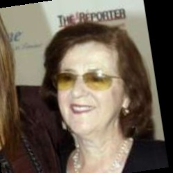 | 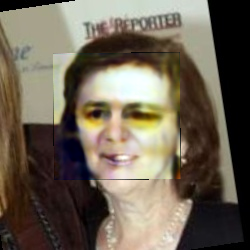 | 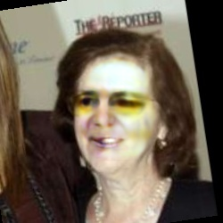 | 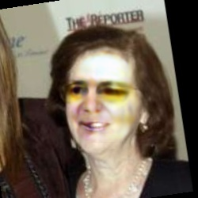 |
| 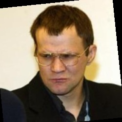 | 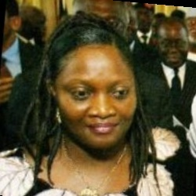 | 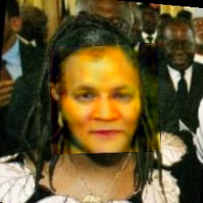 | 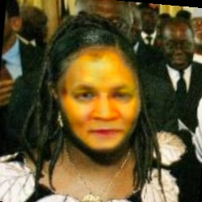 | 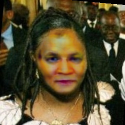 |
|  | 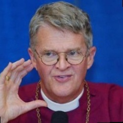 | 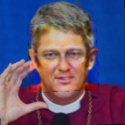 | 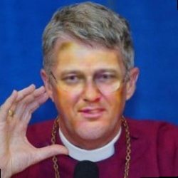 | 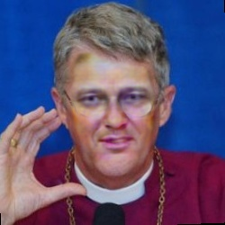 |
| 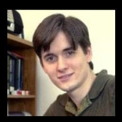 | 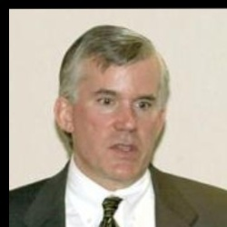 | 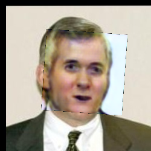 |  | 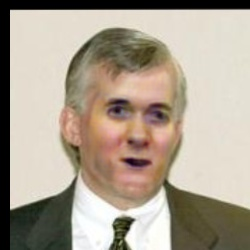 |
| 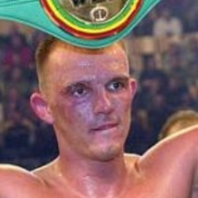 | 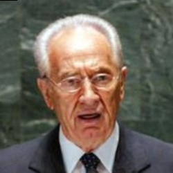 | 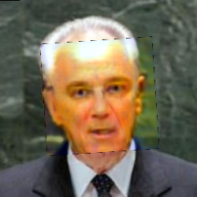 | 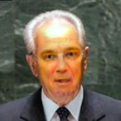 |  |
|  |  |  |  |  |
|  |  |  |  |  |
|  |  |  |  |  |
|  |  |  |  |  |

**Image to Video (I2V)**
To extend our inference to videos we, simply wrap the existing pipeline in a loop over all video frames. Full videos are available `docs/results_images/` folder and here we provide gifs.

The original video was 103 frames at 896 by 896 pixels, and it took 66 second to render out the video. So the inference speed was about 1.5 frames per second. Note that this was done by naively looping over all frames and calling the model once per target image. A more robust solution could attempt to batch these and hope to achieve closer to realtime.

|Source| Target and FaceSwap|
|:---:|:---:|
|||

The fact that our model was designed for images becomes quite evident. There is no motion signal passed to the generator and so the face swap feels as if it were like a pasted on sticker. While the face swap is able to modify the lips as they move with the chin and head orientation the expression is rather muted. Furthermore natural facial muscles and thin cheeks aren't clearly rendered. The most uncanny element are the eyes, they never squint or blink.

We show some more representative examples on videos. In the first video we see that even though the target identity has expressive lip shapes, since the source is drinking from a straw and the lips are closed the resulting expressions are quite limited. In the second video, however we see the opposite. Notice how at the end of the video the expression on the target identities face turns from sadness to laughter and this is visible in the face swap as well. The third video is most challenging since it contains a target identity eat so there are several occlusions. To compensate for this the fork simple slides under the face.

|Source| Target and FaceSwap|
|:---:|:---:|
|||
|||
|||

## Limitations and Future Works


**Limitations**: From a capabilities standpoint this work suffers the usual symptoms of face based models. It struggles to render fine details like wrinkles, mouth interior, facial hair and has difficulty adapting to unconstrained environments like motion blur, harsh lighting, makeup, occlusions.  These issues can be remedied in most part with greater diversity in the face datasets in terms of both number of identities and number of images per identity.

One aspect not evaluated in this was how robust the model is to face swaps as the head pose reaches extreme angles, like turning to a profile view. We suspect the model will have degraded performance since the majority of faces in the training set are frontal.

Our inference scripts also do not handle images/videos with multiple faces, we simply swap the first face the face detector finds.

**Future Work**: During training it was observed that the generated had small grid like patterns at times. In fact, this "texture sticking" or aliasing artifacts are a known issue in many StyleGan like models due to the way the convolutional upsampling works. There are some proposed fixes in the [StyleGan3 paper](https://nvlabs.github.io/stylegan3/).


From a modeling perspective, we noticed that often times expression and appearance weren't properly retained between the target image and the generated image. We could try to explicitly constrain this by adding more loss terms to the generator (in spirit to the ArcFace identity loss) like a [FLAME based expression](https://github.com/yfeng95/DECA) loss. Additionally an interesting architecture followup would be to investigate better ways of incorporating identity in the bottleneck. Right now it is done via a adaptive layer norm modulation, but we could try light weight attention units to see if those could also influence faster transfer.

